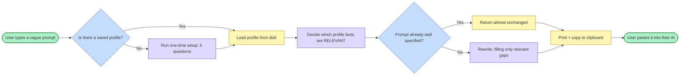

# 02 — How It Works

[[00 - INDEX|← back to index]]

## The design decision that defines the product

Every competitor sits on one side of a trade-off:

- **Fast but guessing** — one-click rewrite, invents the missing details
- **Accurate but slow** — asks clarifying questions on every prompt

Neither is satisfying. Asking costs time; saving time is the whole point.

**The third path:** ask once during setup, then never again.

> Day one: five questions, two minutes, once.
> Every day after: zero questions, zero friction, and it isn't guessing — it's recalling.

This is faster than Refine mode *and* more accurate than one-click mode. That is the entire competitive argument.

## The loop

## Why the "already well specified?" branch matters

It is not an optimisation. It is a correctness requirement.

A tool that rewrites *every* prompt is not judging — it is just generating. In testing, the tool took a prompt that already specified length, audience, tone and structure, and made it three times longer and worse.

> **Rewriting a good prompt is a failure, not a success. Restraint is the skill.**

That sentence is now literally in the meta-prompt. See [[13 - Code Reference]].

## What memory can and cannot fix

Tested against seven real prompts written by the user before the tool existed:

| Prompt | Memory alone? |
|---|---|
| `first we should make a blue print in miro` | ✅ Yes |
| `so tell me how much time it will take` | ✅ Yes |
| `add also a blueprint about where we start...` | ✅ Yes |
| `i want to add in github repos` | 🟡 Partly |
| `can u mak this horizonatal` | ❌ **No** |

**5 of 7 recoverable from memory alone.**

Both failures needed **what the user was looking at**, not who the user is. Hence the two-part positioning:

> **Memory** for who you are. **Context** for what you're doing.

The context half is not built. See [[15 - Open Problems]].
