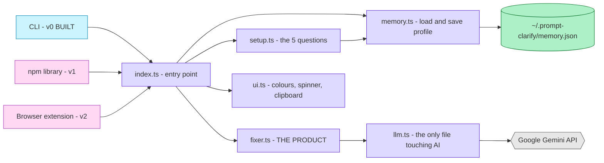

# 04 — Architecture

[[00 - INDEX|← back to index]]

## The principle

**One core engine. Many surfaces.**

The CLI, the future npm library and the future browser extension all call the same code. Nothing about the product logic knows which surface it is running under.

## Why `llm.ts` is isolated

Every AI call goes through one function: `ask()`.

Nothing else in the project knows Gemini exists. If you switch to OpenAI, Claude or a local model, you change **one file** and nothing else breaks.

This already paid off twice:

1. When Google retired `gemini-2.5-flash` mid-build, the fix was one line
2. When we needed retry logic for rate limits, it went in one place and every caller benefited

## Why memory lives in the home folder

`~/.prompt-clarify/memory.json` — **not** in the project folder.

Three reasons:

1. It survives if the project folder is deleted
2. It can never be committed to GitHub by accident
3. One profile works across every project the user has

## Why zero dependencies for the UI

Colours are ANSI escape codes. Clipboard is `pbcopy` / `clip` / `xclip`, all built into the OS.

Adding `chalk` and `clipboardy` would mean two more packages, two more supply-chain risks, and a bigger install — for something that takes 40 lines.

**Current dependency count: 2** (`@google/genai`, `dotenv`).

## What is deliberately NOT built yet

| Thing | Why not |
|---|---|
| Tests | Step 12 |
| `bin` entry for `npx prompt-clarify` | Step 15 |
| Context reading (screen / session) | See [[15 - Open Problems]] |
| Multi-model support | Pick one, make it excellent |
| Hosted web app | Extension beats it on distribution |
