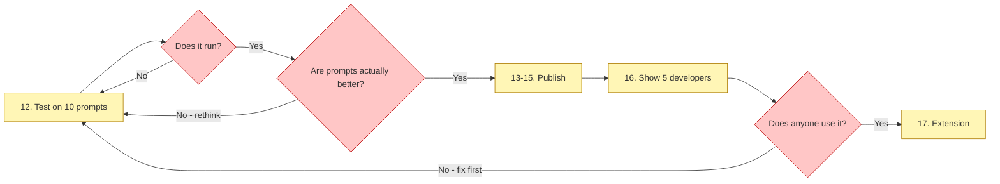

# 07 — The 18 Steps

[[00 - INDEX|← back to index]]

**Who does what:** yash does setup, judgement and testing. Claude writes the code.

**The one rule:** do the steps in order. Each step proves the last one worked. Skipping means debugging two unknowns at once.

---

## PART 1 — Set up the computer ✅ COMPLETE (5 Aug)

- [x] **1. Install Node.js** — Node v22.23.1, npm 10.9.8
- [x] **2. Install VS Code** — already present
- [x] **3. Install Git** — Git 2.50.1, name/email configured
- [x] **4. GitHub account + repo** — `Yash707077`, repo `prompt-clarify` created public with MIT licence and Node `.gitignore`
- [x] **5. Free Gemini API key** — separate Google Cloud project, billing OFF

## PART 2 — Build the tool

- [x] **6. Create project folder** (6 Aug) — cloned to `~/Desktop/prompt-clarify`
- [x] **7. Print hello in terminal** (6 Aug) — TypeScript + tsx running
- [x] **8. Connect to Gemini** (6 Aug) — first AI reply received
- [x] **9. Build MEMORY setup** (7 Aug) — `memory.ts`, `setup.ts`
- [x] **10. Build PROMPT FIXER** ⭐ (7 Aug) — `fixer.ts`, the actual product
- [x] **11. Make it look nice** (7 Aug) — `ui.ts`, zero new dependencies
- [ ] **12. Test on 10 real prompts** ⏳ *in progress* — runner built, blocked on daily quota

## PART 3 — Publish

- [ ] **13. Push code to GitHub** — *(partially done; committing continuously)*
- [ ] **14. Write README with GIF**
- [ ] **15. Publish to npm** — needs a `bin` entry first
- [ ] **16. Show 5 real developers** — *the step that actually matters*

## PART 4 — Later (week 6–8)

- [ ] **17. Build Chrome extension**
- [ ] **18. Pay $5 fee and publish** — do NOT pay early

---

## Checkpoints

Those loops are the difference between a plan and a plan that admits it might be wrong.

## Cost

**Parts 1, 2 and 3 = ₹0.** Only Step 18 costs money ($5, one time, months away).

## Time estimates — original vs actual

| | Estimated | Actual |
|---|---|---|
| Part 1 (setup) | 2 hours | ~2 hours ✅ |
| Steps 6–8 | 2 days | 1 session ✅ |
| Steps 9–11 | 4–5 days | 1 session ✅ |
| Step 12 | 1 day | 2+ sessions, blocked on quota |

**Lesson:** writing code was faster than estimated. *Testing* was slower — because testing is where reality intrudes.
